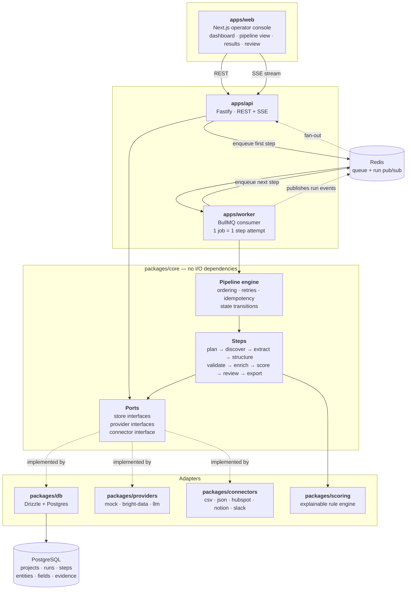
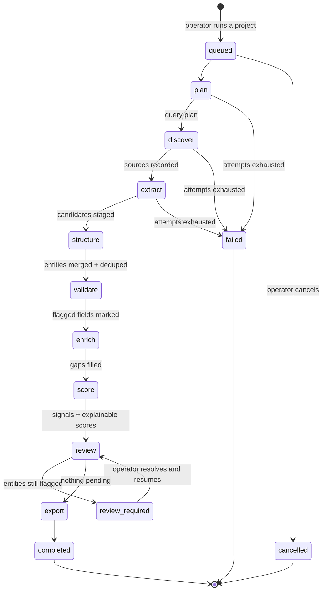
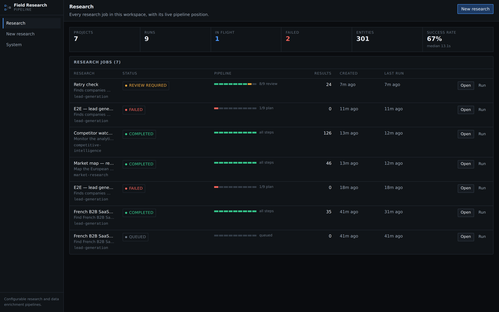
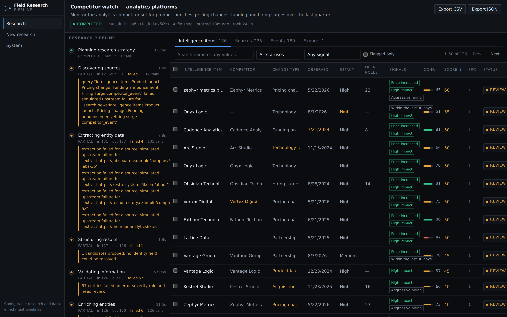
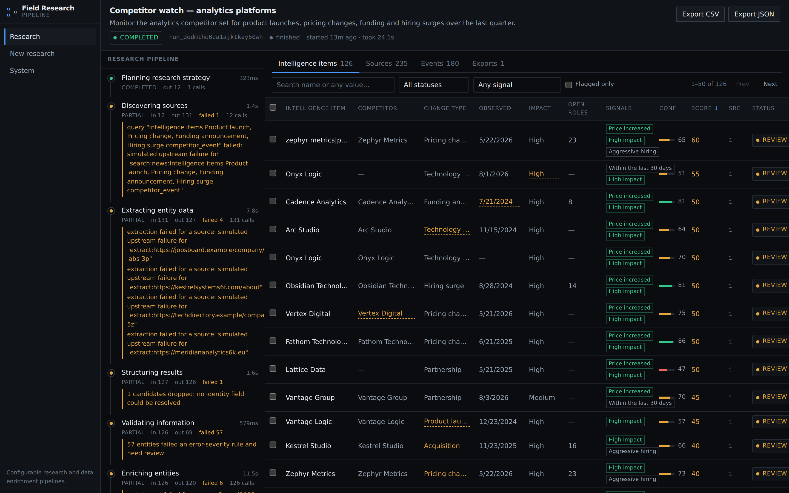
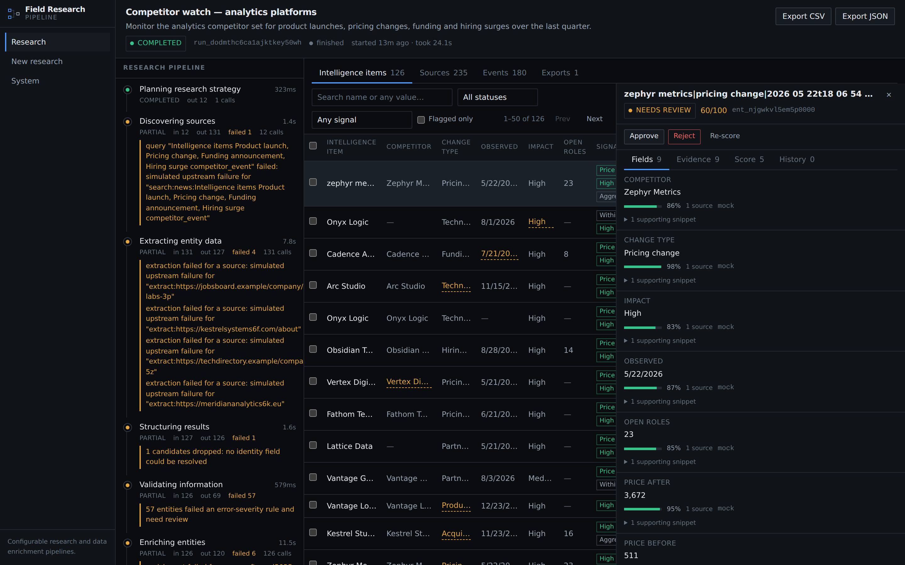
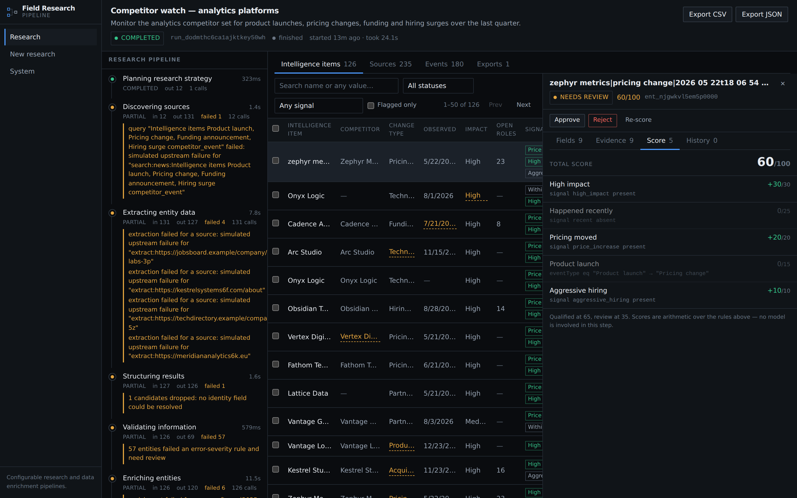

# Field Research Pipeline

**A configurable framework for building research and data enrichment pipelines.**

Turn a research objective into a structured, validated, traceable dataset — with a
human in the loop and an audit trail from every value back to the document it
came from.

It is not an AI scraper, a Bright Data wrapper, or a chat UI. It is the
orchestration, state management, review workflow and operational surface that
sit _around_ those primitives and turn them into a system a team can run every
day.

```
docker compose up
# → http://localhost:3000
```

The whole thing runs with **no API keys**. A mock provider suite simulates real
provider contracts — latency, rate limits, partial failures, conflicting
sources, missing fields — so you can see the system behave under realistic
conditions before wiring up anything that costs money.

---

## Contents

- [The problem](#the-problem)
- [What it does](#what-it-does)
- [Architecture](#architecture)
- [Pipeline lifecycle](#pipeline-lifecycle)
- [Screenshots](#screenshots)
- [Local development](#local-development)
- [Configuration](#configuration)
- [Providers](#providers)
- [Connectors](#connectors)
- [Example pipelines](#example-pipelines)
- [Extending the framework](#extending-the-framework)
- [Deployment](#deployment)
- [Project layout](#project-layout)
- [What is and isn't implemented](#what-is-and-isnt-implemented)

---

## The problem

"Find every French B2B SaaS company with 20–500 employees that recently raised,
uses HubSpot, and is hiring" is a two-minute request and a two-week project.

The hard parts are never the API calls:

- **Identity.** Three pages describe the same company. One says 240 employees,
  another says 265. Which record ships, and can you explain why?
- **Trust.** An extracted field is a guess with a probability attached. Which
  guesses need a human, and how does that human find them among 400 rows?
- **Traceability.** Six weeks later, someone asks where a number came from. You
  need the page, the sentence, and the timestamp — not a re-run.
- **Operations.** Runs fail halfway. Providers rate-limit. A worker dies. The
  system has to resume, not restart, and tell you what happened.
- **Change.** The next client wants competitor monitoring instead. That should
  be a configuration file, not a fork.

This framework is an opinionated answer to those five problems.

---

## What it does

A **research project** pairs an objective with a pipeline configuration. Running
it produces a **run**, which walks nine explicit steps and leaves behind a
structured dataset where every field carries its confidence, its provenance and
its review state.

| Concern      | How it is handled                                                                           |
| ------------ | ------------------------------------------------------------------------------------------- |
| Identity     | Configurable dedupe key + normaliser; field-level merge with agreement counting             |
| Trust        | Per-field confidence; conflicts lower it; sub-threshold fields are flagged                  |
| Traceability | `entity → field → evidence → source`, with the supporting snippet stored                    |
| Operations   | One queue job per step attempt; retries, resumability, idempotency, structured events       |
| Change       | One configuration object drives extraction, validation, signals, scoring, review and export |
| Human review | A real pipeline gate that halts the run — not a notification                                |

---

## Architecture



### The decisions that matter

**One queue job equals one attempt of one pipeline step.** This single choice
buys most of the operational properties for free: retries and backoff become
queue concerns (a waiting step costs a queue delay, not a blocked worker slot);
a worker crash loses at most one step attempt; each step is individually
observable in any BullMQ dashboard; and a redelivered job resumes rather than
restarts, because the step's own record says it already finished.

**The core depends on interfaces, never on infrastructure.** `packages/core`
imports no database driver, no HTTP client and no queue. It defines store ports,
provider contracts and a connector interface; `packages/db`, `packages/providers`
and `packages/connectors` implement them. The full nine-step pipeline runs
against in-memory stores in about 50ms in the test suite — which is how you know
the boundary is real and not aspirational.

**Human review is a step, not a flag.** The `review` step returns `suspended`,
the run moves to `review_required`, and the queue stops. Nothing is exported.
Resolving the queue and resuming re-enters the same step, which re-evaluates —
so a run cannot slide past the gate. Making it a step rather than a status is
what stops "reviewed" from becoming a label nobody enforces.

**Scores are arithmetic, not judgement.** The scoring engine evaluates named
rules over a small declarative condition language and returns a breakdown where
every point is attributable to a rule and a readable reason. A model may produce
a _field_ a rule reads; no model produces the score.

**A projection is never the source of truth.** `entities.data` exists so the
results table renders fast, and `entities.signals` so it renders signals — but
both are recomputed from `entity_fields` and `entity_signals`. Every write path
goes through the code that refreshes them.

---

## Pipeline lifecycle



| Step        | What it does                                                                           | Failure behaviour                                |
| ----------- | -------------------------------------------------------------------------------------- | ------------------------------------------------ |
| `plan`      | Objective + targeting → queries with stated intent, plus per-field extraction guidance | Retryable ×3                                     |
| `discover`  | Runs the queries; records every source **before** anything reads it                    | Partial: failed queries warn, the run continues  |
| `extract`   | Per source: values coerced to their declared type, each with evidence                  | Partial; values without evidence are dropped     |
| `structure` | Merges candidates by dedupe key; agreement raises confidence, conflict lowers it       | Partial; candidates with no identity are dropped |
| `validate`  | Required fields, configured rules, confidence threshold → flags                        | Partial                                          |
| `enrich`    | Fills gaps from an entity-keyed provider; never overwrites a human edit                | Partial; skipped when disabled                   |
| `score`     | Recomputes signals, then applies scoring rules                                         | —                                                |
| `review`    | **Gate.** Suspends the run while entities are flagged                                  | Suspends                                         |
| `export`    | Streams rows to each enabled destination; one failure does not fail the others         | Partial                                          |

Every step is idempotent, records its own metrics (`itemsIn`, `itemsOut`,
`itemsFailed`, `providerCalls`, `durationMs`), and emits structured events.

---

## Screenshots

> Captured from the running demo with the mock providers.

**Research dashboard** — every job with its live pipeline position.



**Run view** — the pipeline is real backend state, streamed over SSE. The left
rail shows each step's status, attempt count, metrics, warnings and errors.



**Results explorer** — columns are generated from the pipeline configuration.
Low-confidence cells are marked in place.



**Entity detail** — per-field confidence, agreement count, and the exact
snippets and source URLs behind each value.



**Score breakdown** — every point attributed to a named rule with its reason.



---

## Local development

Requirements: Node 20.11+, pnpm 10, and either Docker or a local
PostgreSQL 16 + Redis 7.

### With Docker (recommended)

```bash
cp .env.example .env
docker compose up --build
```

The API applies migrations and seeds three demo projects on boot. Open
<http://localhost:3000> and press **Run** on any of them.

### Without Docker

```bash
cp .env.example .env          # defaults point at localhost
pnpm install
pnpm db:migrate
pnpm seed
pnpm dev                      # api :4000 · worker · web :3000
```

`pnpm dev` runs the API and worker from the repository root so both resolve
`EXPORT_DIR` to the same directory.

### The demo path

1. Open the dashboard — three seeded projects, one per example pipeline.
2. Press **Run**. You land on the run view and watch the pipeline execute.
3. It stops at **Review required** — the lead-generation pipeline has a blocking
   review gate and some fields came back below the confidence threshold.
4. Open the results table. Flagged cells are underlined. Click a row.
5. In the detail panel: correct a value (it becomes `edited` and is frozen
   against further machine writes), inspect the evidence, read the score
   breakdown.
6. Approve the remaining entities, then **Resume run**. The export step writes
   a CSV and a JSON file you can download.

### Commands

```bash
pnpm dev              # api + worker + web
pnpm test             # unit tests (vitest)
pnpm test:e2e         # Playwright, against a running stack
pnpm typecheck        # whole monorepo
pnpm lint
pnpm db:generate      # regenerate migrations after a schema change
pnpm db:migrate
pnpm db:reset         # drop and recreate the schema (development only)
pnpm seed
```

---

## Configuration

A deployment is defined by a single serialisable object. This is the whole
adaptation surface — there is no per-client fork.

```ts
import { defineResearchPipeline } from '@frp/config';

export const leadGenerationPipeline = defineResearchPipeline({
  key: 'lead-generation',
  name: 'B2B lead generation',

  entity: {
    type: 'company',
    label: 'Company',
    labelPlural: 'Companies',
    displayField: 'name',
    // Two records are the same company when their domains match.
    identity: { fields: ['website'], normalizer: 'domain' },
  },

  // Renders the "Create Research" form. Nothing about industries is hardcoded
  // in the UI — it reads this.
  targeting: {
    fields: [
      { key: 'industry', label: 'Industry', type: 'select', options: [/* … */] },
      { key: 'companySize', label: 'Company size', type: 'range', min: 1, max: 5000 },
    ],
  },

  discovery: { maxResults: 100, sources: ['web', 'directory'] },

  // Drives extraction, coercion, table columns and the mock generator.
  extraction: {
    fields: [
      { key: 'name', label: 'Company', type: 'string', required: true },
      { key: 'website', label: 'Website', type: 'url', required: true },
      { key: 'employeeCount', label: 'Employees', type: 'integer' },
      { key: 'technologies', label: 'Technologies', type: 'string_array' },
    ],
  },

  signals: [
    {
      key: 'uses_hubspot',
      label: 'Uses HubSpot',
      tone: 'positive',
      source: 'derived',
      when: { field: 'technologies', op: 'contains', value: 'HubSpot' },
    },
  ],

  validation: {
    minimumConfidence: 0.75,
    rules: [
      { id: 'has-website', label: 'Website present', require: { field: 'website', op: 'exists' } },
    ],
  },

  scoring: {
    thresholds: { qualified: 70, review: 40 },
    rules: [
      { id: 'uses-hubspot', label: 'Uses HubSpot', weight: 20, when: { signal: 'uses_hubspot' } },
      {
        id: 'too-large',
        label: 'Outside the motion',
        weight: -15,
        when: { field: 'employeeCount', op: 'gt', value: 1500 },
      },
    ],
  },

  review: { enabled: true, blocking: true, flagBelowConfidence: 0.75 },

  export: {
    destinations: [
      {
        id: 'csv',
        label: 'CSV',
        connector: 'csv',
        filter: { field: 'score', op: 'gte', value: 70 },
      },
    ],
  },
});
```

Only `key`, `name`, `entity` and `extraction.fields` are required; every other
section has defaults. Configurations are validated at definition time, and
invalid ones fail with the offending path — a scoring rule referencing a field
you removed is caught before a run starts, not three steps in.

One small condition language serves signal detection, validation rules, export
filters and scoring, so there is one thing to learn. See
[docs/configuration.md](docs/configuration.md).

---

## Providers

The pipeline knows the outside world through four interfaces:

```ts
interface ResearchProvider {
  plan(input, ctx): Promise<ResearchPlan>;
}
interface SearchProvider {
  search(query, ctx): Promise<SearchResult[]>;
}
interface ExtractionProvider {
  extract(input, ctx): Promise<ExtractionOutput>;
}
interface EnrichmentProvider {
  enrich(input, ctx): Promise<EnrichmentOutput>;
}
```

| Provider      | Stages               | Credentials           | Status                                                                           |
| ------------- | -------------------- | --------------------- | -------------------------------------------------------------------------------- |
| `mock`        | all four             | none                  | Complete. Default.                                                               |
| `llm`         | research, extraction | `ANTHROPIC_API_KEY`   | Implemented; schema-constrained structured outputs                               |
| `bright-data` | search, extraction   | `BRIGHT_DATA_API_KEY` | Implemented from public API docs, **not verified against a live account**        |
| `bright-data` | enrichment           | —                     | **Not implemented** — dataset choice is client-specific; it throws a clear error |

Selection is per stage, and per pipeline, falling back to deployment defaults:

```bash
PROVIDER_SEARCH=bright-data
PROVIDER_EXTRACTION=llm
```

### The mock provider is the point

It is not a fixture file. It maintains a deterministic synthetic world derived
from a seed, and _observes_ it noisily:

- reproducible for a given seed, genuinely different for a different one;
- driven entirely by your configuration's field definitions — a pipeline about
  market segments produces market segments, never company fields;
- sources disagree, so the merge step has conflicts to resolve;
- fields go missing, so validation has something to flag;
- calls take time and fail intermittently — and a simulated transient failure
  _recovers on retry_, because the failure roll includes the attempt number.

That last detail matters: without it, `retryable: true` would be a lie and the
retry path would never be exercised.

See [docs/providers.md](docs/providers.md) for writing your own.

---

## Connectors

```ts
interface Connector {
  readonly meta: ConnectorMeta;
  write(input: ConnectorWriteInput): Promise<ConnectorResult>;
}
```

Rows are streamed, so a 50k-entity export uses the same memory as a 50-entity
one.

| Connector | Status                                                                                                                       |
| --------- | ---------------------------------------------------------------------------------------------------------------------------- |
| `csv`     | Complete. RFC 4180 quoting; formula injection neutralised                                                                    |
| `json`    | Complete. JSON or NDJSON, with full per-field provenance                                                                     |
| `hubspot` | Property mapping and batching implemented and tested; live API call written from public docs, unverified. Dry-run by default |
| `notion`  | Same status                                                                                                                  |
| `slack`   | Same status                                                                                                                  |

Credentialed connectors default to **dry run**: they write the exact request
bodies they would send to disk, so you can inspect them before enabling the live
path. That is deliberate — a public repository should not pretend a CRM push
succeeded. See [docs/connectors.md](docs/connectors.md).

---

## Example pipelines

Three configurations ship in `examples/`, chosen because they stress different
parts of the design:

| Example                                                         | Entity               | Identity                 | What it demonstrates                                                                                     |
| --------------------------------------------------------------- | -------------------- | ------------------------ | -------------------------------------------------------------------------------------------------------- |
| [`lead-generation`](examples/lead-generation)                   | `company`            | domain                   | Signals, weighted scoring with a penalty, blocking review, CRM destination                               |
| [`competitive-intelligence`](examples/competitive-intelligence) | `competitor_event`   | competitor + type + date | A non-company entity; composite identity; **non-blocking** review because intelligence is time-sensitive |
| [`market-research`](examples/market-research)                   | `market_participant` | domain                   | Graded (interpolated) scoring; review disabled because coverage matters more than per-row precision      |

The middle one is the interesting proof: the entity is an _observed change_, not
an organisation. Changing `entity.type` and the identity fields is the entire
adaptation. Nothing in `packages/` knows any of these use cases exist.

---

## Extending the framework

Standing up a new client deployment:

1. **Write a configuration** — `defineResearchPipeline({ … })`.
2. **Register it** — add it to `apps/api/src/pipelines.ts`. That file is the
   only place a deployment differs.
3. **Pick providers** — environment defaults, or per pipeline.
4. **Add a connector** if the client needs a destination that does not exist —
   implement one interface, register it.
5. **Deploy.**

Adding a provider, a connector or a step is documented in
[docs/extending.md](docs/extending.md). The pipeline's nine-step spine is
deliberately fixed: you can replace a step's _implementation_ (a client with an
internal entity resolver can substitute `structure`), but not reorder the
sequence — that is what keeps runs comparable and debuggable across deployments.

---

## Deployment

`docker compose up --build` is the reference deployment. For anything real:

- Put the API behind TLS and set `API_KEY`, or replace the shared-secret hook
  with proper authentication (see [docs/security.md](docs/security.md)).
- Scale workers horizontally — `WORKER_REPLICAS`. The queue distributes step
  attempts; nothing in a worker is stateful.
- Point `EXPORT_DIR` at shared storage, or write a connector that targets object
  storage directly.
- Run migrations as a release step rather than at container boot.
- Multi-tenancy: every tenant-owned row already carries `tenant_id`, so
  PostgreSQL row-level security can be switched on without a migration. The demo
  runs single-tenant; [docs/security.md](docs/security.md) says exactly what is
  missing and where it hooks in.

---

## Project layout

```
apps/
  api/          Fastify — REST, SSE run stream, review + export endpoints
  worker/       BullMQ consumer — executes one step attempt per job
  web/          Next.js operator console
packages/
  core/         Pipeline engine, step implementations, provider + store ports
  schemas/      Zod domain schemas — the single definition of the wire contract
  config/       defineResearchPipeline, overrides, registry, environment
  db/           Drizzle schema, migrations, store implementations
  providers/    mock · bright-data · llm
  connectors/   csv · json · hubspot · notion · slack
  scoring/      Condition evaluator + explainable scoring engine
  queue/        BullMQ queue and Redis run pub/sub
examples/       Three ready-to-run pipeline configurations
infra/docker/   Dockerfiles
docs/           Architecture, configuration, providers, connectors, security…
```

`packages/queue` and `packages/db` are additions to the layout sketched in the
brief; the queue and the datastore each needed a home that neither `core` (which
must stay I/O-free) nor the apps (which both use them) could provide.

---

## What is and isn't implemented

Stated plainly, because a portfolio repository that overclaims is worse than one
that does less.

**Implemented and verified end to end**

- The nine-step pipeline, executing against Postgres and Redis
- Retries with backoff, partial-failure handling, resumability, idempotency
- Deduplication and field-level merge with conflict resolution
- Confidence flagging, the blocking review gate, resume semantics
- Explainable scoring, including graded rules and penalties
- CSV and JSON export, with download endpoints
- Live run streaming (SSE over Redis pub/sub) with a polling fallback
- The full operator console: dashboard, create flow, run view, results
  explorer, entity detail, review
- 107 unit tests and a Playwright end-to-end test of the demo path

**Implemented but not verified against live third-party accounts**

- The Bright Data search and extraction adapters
- The HubSpot, Notion and Slack connectors' network paths
- The LLM provider (written against the documented structured-outputs API)

These are written from public documentation and are clearly marked in the source
and in the docs. Dry-run modes exist so you can inspect exactly what would be
sent.

**Deliberately not implemented**

- Authentication beyond an optional shared secret — see
  [docs/security.md](docs/security.md) for the design
- Tenant isolation enforcement (the data model supports it; RLS is not enabled)
- Bright Data dataset enrichment — dataset selection and schema mapping are
  per-client decisions, so the adapter fails loudly rather than guessing
- Scheduled/recurring runs
- Provider cost accounting

---

## Documentation

| Document                               | What it covers                                                        |
| -------------------------------------- | --------------------------------------------------------------------- |
| [Architecture](docs/architecture.md)   | Layers, the engine, the data model, merge semantics, trade-offs taken |
| [Configuration](docs/configuration.md) | Every field of a pipeline configuration, with the condition language  |
| [Providers](docs/providers.md)         | The four interfaces, the provider contract, writing your own          |
| [Connectors](docs/connectors.md)       | The connector interface, shipped connectors and their honest status   |
| [Development](docs/development.md)     | Running locally, testing, debugging a run, common problems            |
| [Extending](docs/extending.md)         | New pipelines, providers, connectors, steps — and where things live   |
| [API reference](docs/api.md)           | Every endpoint, including the SSE stream                              |
| [Security](docs/security.md)           | What is implemented, what is missing, and where to add it             |
| [Examples](examples/README.md)         | The three shipped pipelines and why each exists                       |

## Licence

MIT — see [LICENSE](LICENSE).
