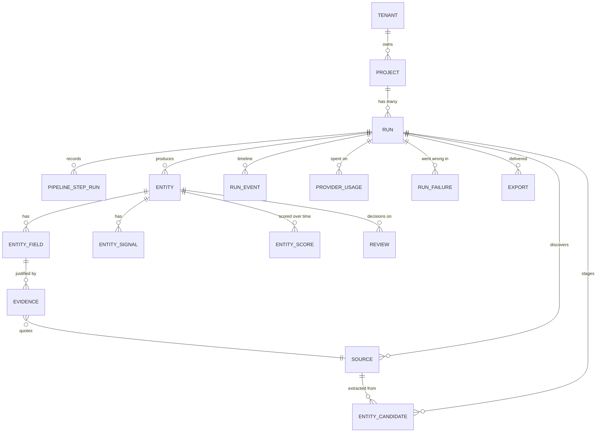

# Architecture

This document explains how the system is put together and, more usefully, _why_
each boundary is where it is. It assumes you have read the [README](../README.md).

---

## 1. The shape of the problem

A research pipeline is a long-running, partially-failing, externally-dependent
process whose output a human must be able to trust and correct. That shape
dictates almost every decision here:

| Property of the problem         | Consequence in the design                                               |
| ------------------------------- | ----------------------------------------------------------------------- |
| Long-running (minutes to hours) | State lives in Postgres, not in memory. A process can die at any point. |
| Partially failing               | Steps report `partial`; one bad source does not lose the run.           |
| Externally dependent            | Providers are interfaces; retries and rate limits are first-class.      |
| Output must be trusted          | Every value carries confidence and evidence.                            |
| Output must be correctable      | Human edits are a write path with precedence over machine writes.       |
| Requirements change per client  | Behaviour is configuration, not code.                                   |

---

## 2. Layers

```
apps/          ─ processes: HTTP, queue consumer, browser
packages/core  ─ the pipeline: engine, steps, ports. No I/O dependencies.
adapters/      ─ db, providers, connectors, queue: implement the ports
packages/schemas ─ the shared vocabulary every layer speaks
```

The rule that keeps this honest: **`packages/core` may not import anything that
performs I/O.** No `pg`, no `ioredis`, no `fetch`. It declares what it needs as
interfaces, and something else supplies an implementation.

You can verify the boundary rather than trust it:

```bash
grep -rE "from '(pg|ioredis|bullmq|@anthropic-ai)" packages/core/src   # no matches
pnpm --filter @frp/core test                                          # full pipeline, no services
```

The core's test suite runs the complete nine-step pipeline against in-memory
stores and scripted providers in roughly 50 milliseconds. That is only possible
because the boundary is real.

---

## 3. The pipeline engine

`PipelineEngine` owns exactly three things:

1. **Which step runs next** — a fixed order (`PIPELINE_STEP_ORDER`).
2. **How one step attempt executes and is recorded** — `executeStepAttempt`.
3. **What the outcome means for the run** — `settleRun`.

It knows nothing about what any step does.

### Retries are not an internal sleep

`executeStepAttempt` performs exactly **one** attempt and reports whether
another is worthwhile. The caller decides how to schedule it:

- In the deployed system, the caller is the BullMQ worker. It rethrows, and
  BullMQ applies exponential backoff — so a waiting step costs a _queue delay_,
  not a blocked worker slot.
- In tests and the in-process runner, `runToCompletion` loops with the same
  semantics.

This is why a step with a 30-second backoff does not occupy a worker for 30
seconds.

### Step outcomes

| `StepResult.status` | Meaning                                       | Run effect                           |
| ------------------- | --------------------------------------------- | ------------------------------------ |
| `completed`         | Clean success                                 | Advance                              |
| `partial`           | Usable output despite recoverable errors      | Advance; warnings surface in the UI  |
| `skipped`           | Not applicable to this configuration          | Advance                              |
| `suspended`         | Waiting for an external signal (human review) | Run → `review_required`; queue stops |
| (throws)            | Failure; `retryable` decides what happens     | Retry, or run → `failed`             |

### Idempotency and resumability

Every step is idempotent, and the engine enforces it structurally:

- A step whose record says `completed` or `skipped` is **never re-executed**,
  even if the queue redelivers its job after a worker crash.
- Write keys are deterministic: a source's id is
  `deterministicId('src', runId, canonicalUrl)`, an entity's is
  `deterministicId('ent', runId, dedupeKey)`. Re-running converges instead of
  duplicating.
- Counters are incremented inside Postgres (`stats || jsonb_build_object(…)`),
  so parallel attempts cannot lose an increment.

---

## 4. Why one job per step attempt

The alternative — one job per run, looping internally — is simpler to write and
much worse to operate:

|                     | One job per run         | **One job per step attempt** |
| ------------------- | ----------------------- | ---------------------------- |
| Retry granularity   | The whole run           | The failed step              |
| Worker crash        | Lose the run's progress | Lose one attempt             |
| Backoff cost        | A blocked worker        | A queue delay                |
| Observability       | One opaque job          | Nine, each with metrics      |
| Resume after review | Bespoke machinery       | Enqueue one step             |

Each step enqueues its successor only _after_ its own result is durably
recorded, so the queue and the database cannot disagree about where a run is.

Job ids are `${runId}--${stepId}`, which deduplicates a double-clicked "Run".
Because BullMQ retains finished jobs, `enqueueStep` removes a _finished_ job
under the same id before re-adding — otherwise resuming a paused run would
silently no-op. (It did, once. There is a test.)

---

## 5. Data model



### The traceability chain

The chain that makes the system worth building:

```
entity → entity_field → evidence → source
```

Asking "where did this employee count come from?" is a two-join query, and the
UI answers it in the detail panel: the value, its confidence, how many
independent sources agreed, the exact quoted snippet, and a link to the page.

### Projections

`entities.data` and `entities.signals` are **projections** of `entity_fields`
and `entity_signals`. They exist so a 500-row table renders without 500 joins.
They are never written by a caller: every path that changes a field ends in the
entity store, which refreshes the projection in the same transaction. That is
what stops the fast read path and the traceable path from drifting apart.

### Why candidates are staged

`extract` writes to `entity_candidates`; `structure` reads them and merges.
Keeping them in their own table rather than in the step's output column means
extraction stays resumable over large runs, and a bad merge can be re-run
**without re-paying for extraction** — which matters when extraction is the
expensive step.

### Snapshots

A run stores `config_snapshot`. Editing a project never rewrites history, so a
six-week-old result set can still be explained by the rules that actually
produced it.

The same reasoning applies to a source's trust score: it is resolved when the
source is recorded and stored on the row, not recomputed on read. A run keeps
the verdict it actually acted on even after the trust configuration changes,
which is what makes an old confidence figure explainable.

### Two append-only ledgers

`provider_usage` and `run_failures` are written but never updated.

`provider_usage` holds one row per upstream call. A run's cost is the sum of
what it did; a row that can be edited is a number nobody can defend. The
run-level rollup is therefore computed on read rather than kept as a counter,
so the total always matches the calls it claims to summarise. Runs have bounded
cardinality — thousands of calls, not millions — which is what makes that
affordable.

Rows are buffered in the pipeline context and flushed once per step attempt,
including on the failure path. A provider call should not pay a database round
trip to be counted, and a step that dies half-way must still account for what
it spent getting there.

`run_failures` holds the failures a step _tolerated_ alongside the ones that
ended it. A step reporting `partial` has, by construction, swallowed something;
the warning it surfaces is a sentence, and this is the row that says which
document it was, which provider refused, and what the provider replied. The
provider response is redacted at **write** time, not display time — a view
added later cannot reintroduce a leak.

---

## 6. Merge and identity

Deduplication quality decides whether a run produces "140 companies" or "140
rows, 60 of which are the same company three times".

Identity is configured, not assumed:

```ts
identity: { fields: ['website'], normalizer: 'domain' }        // companies
identity: { fields: ['competitor', 'eventType', 'observedAt'] } // events
```

Merging is field-by-field:

| Situation                       | Behaviour                                                                     |
| ------------------------------- | ----------------------------------------------------------------------------- |
| New field                       | Taken as-is, `agreementCount: 1`                                              |
| Sources agree                   | `agreementCount++`, confidence rises (capped at 0.99)                         |
| Sources disagree                | Higher confidence wins, **confidence drops by 0.15**, both evidences retained |
| Field is `edited` or `approved` | Frozen — a human decision is never overwritten                                |

The confidence penalty on conflict is deliberate: a disputed value should land
in the review queue rather than ship silently. Numbers within 10% count as
agreement, because headcounts and funding amounts are estimates.

---

## 7. Human review as control flow

The `review` step returns `suspended` when entities are flagged and the
configuration says `blocking`. The run moves to `review_required` and the queue
stops. Nothing is exported.

Resuming clears the step's record and re-enqueues it, so the gate
**re-evaluates**. If entities are still flagged, the run parks again. An
operator can override with `{ force: true }`, which is recorded as an explicit
event — accepting unreviewed data is a decision, and decisions are logged.

`POST /runs/:id/resume` is idempotent and self-healing: it enqueues before it
changes run status, and it accepts a run already in `running`, so an interrupted
resume can simply be retried.

---

## 8. Live run state

```
worker → engine.emit() → event row in Postgres
                       → Redis publish on frp:run:<id>
                                  ↓
                       API SSE endpoint (one subscriber connection per client)
                                  ↓
                       browser: EventSource → React Query cache
```

Two properties worth noting:

- **The snapshot-then-subscribe order** avoids the race where a run finishes
  between page load and subscription.
- **A polling fallback runs alongside**, so a buffering proxy or a dropped
  connection degrades to a 4-second refresh rather than a frozen page. Both
  write into the same React Query cache entry, so the view never shows two
  sources of truth. Both stop at a terminal status.

---

## 9. Configuration flow

```
template (examples/*)
    │  applyProjectOverrides(template, overrides)   ← re-validated
    ▼
project.config      (stored; edits never affect past runs)
    │  createRun()
    ▼
run.config_snapshot (immutable; what the steps actually read)
```

Re-validating after overrides matters: narrowing the field set can orphan a
scoring rule or the display field. That is rejected at creation time with the
offending path, rather than three steps into a run.

---

## 10. Observability

Every log line carries `runId`, `stepId`, `attempt` and `provider`.

| Surface              | What it answers                                                                       |
| -------------------- | ------------------------------------------------------------------------------------- |
| `pipeline_step_runs` | Where is the run, how long did each step take, how many attempts                      |
| `StepMetrics`        | `itemsIn`, `itemsOut`, `itemsFailed`, `providerCalls`, `providerErrors`, `durationMs` |
| `run_events`         | The narrative, at four levels, cursor-ordered by a monotonic `seq`                    |
| `runs.stats`         | Cumulative counters: sources, entities, retries, provider errors                      |
| `run_failures`       | What broke, on which document or entity, and the provider's (redacted) response       |
| `provider_usage`     | One row per upstream call: tokens, requests, latency, outcome, cost                   |
| `GET /health`        | Real dependency probes — Postgres, Redis, queue depth                                 |
| `GET /v1/metrics`    | Success rate, median duration, queue state                                            |
| `GET /v1/providers`  | Live provider healthchecks — a missing key is visible here                            |

Events are tailed by `seq`, not by timestamp: two events in the same millisecond
must not be able to hide one another from a poller.

---

## 11. Trade-offs taken

Recorded so a reader can disagree knowingly.

- **The step sequence is fixed.** You can replace a step's implementation but
  not reorder the pipeline. This costs flexibility and buys comparability: every
  run in every deployment has the same nine-step shape, so the UI, the metrics
  and the debugging story are shared. A DAG would be more general and much
  harder to operate.
- **Cooperative cancellation, not pre-emptive.** Steps poll between units of
  work. A step blocked on a slow provider call finishes that call first. The
  alternative — killing workers — makes idempotency much harder to reason about.
- **Postgres for everything, including the event log.** At very high event
  volume a dedicated log store would be better. At the scale this targets, one
  datastore is worth far more than the marginal throughput.
- **Confidence is provider-reported, not calibrated.** The system propagates,
  merges, penalises and trust-weights confidence but does not attempt to
  calibrate a provider's self-assessment. Real calibration needs labelled
  outcomes, which a framework cannot assume.
- **Trust can only lower a confidence, never raise it.** A government register
  does not make a badly-evidenced extraction correct; it just fails to punish a
  well-evidenced one. A symmetric weighting would let a reputable domain inflate
  a weak signal, which is exactly the failure the review gate exists to catch.
- **Cost is an estimate unless the provider says otherwise.** Most APIs report
  tokens, not money, so most cost figures are tokens multiplied by a local price
  table — labelled `estimated` wherever they appear. A model absent from the
  table yields no figure at all and marks the run's total as a floor. A
  confident zero would be the worse failure: it understates a run's cost
  silently, which is the one thing the feature exists to prevent.
- **Enrichment is entity-keyed, not document-keyed.** It fills gaps from an
  entity graph rather than re-reading pages, which is why re-processing an
  entity recomputes signals and score but does not re-extract.
